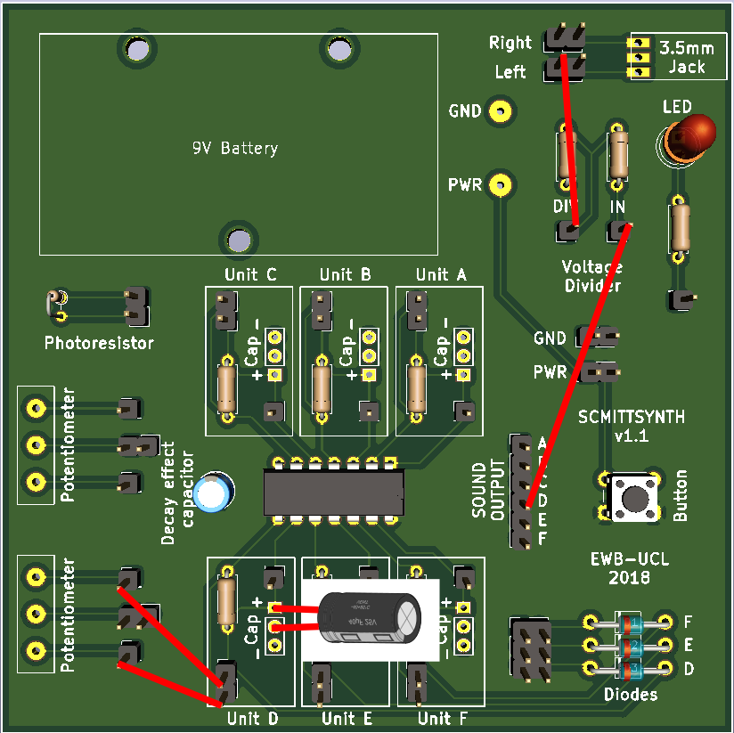

# Schmitt Synth - a digital logic synthesizer

A simple square-wave synthesizer circuit using inverting gates (Logical NOT, Schmitt triggers) in the 40106 Integrated Circuit and a few discrete components. The KiCAD schematic, Printed Circuit Board (PCB) and a cached library are provided.
This project was developed for the University College London branch of Engineers Without Borders as a basis of a workshop.

## Getting Started

### Prerequisites

In order to view and edit the files you are going to need the open source circuitry tool KiCAD, available from:

```
http://kicad-pcb.org/
```

### Installing

After installing KiCAD, the project should simply open upon clicking on the 40106_synth.pro file. From here, you can view the schematic and PCB Layout

## How does the circuit work?

The circuit works by connecting a Schmitt inverter (NOT Gate) in a feedback loop. The inverter outputs a HIGH voltage on its output pin when there is LOW voltage on its input pin and vice versa. By connecting a capacitor between the input pin and ground, we control how long it takes for a voltage change to propagate from the output pin to the input pin, effectively controlling our oscillation frequency. This is proportional to the capacity of our capacitor, as a larger capacitor will take longer to charge. We further connect the input and output pins via a variable resistor (potentiometer), thereby controlling how much current flows between the output pins and to the capacitor, limiting how fast it can charge. We thus obtain an oscillating circuit in which we can control the frequency by changing the capacitance and resistance of the respective components. 

## How to connect your assembled synthesizer

### Basic setup
In order to operate your synth, you need to connect one of the inverting gates to (see under text for demo connections):
1. **a capacitor on its input pin** - you can do this by placing a capacitor between in the female pin header below or above the 40106 IC (black box with legs in the middle of the board). Note that cylindrical capacitors with a stripe (electrolytic) are polarized, and the stripe should be connected to ground, see below. If your capacitor is soldered on, simply choose the desired gate.
2. **a resistance between the input and output pin on the gate (not OUTPUT)** - this allows you to control the tone, as well as ensures the sound is in the audible range and not ultrasound, which annoys animals. You can use either potentiometer or the photoresistor on the board, or use wires to connect to a resistive material, like a pencil drawing or a piece of fruit. You can also connect multiple resistors in series or parallel, to experiment with different effects.
3. **appropriate sound OUTPUT pin to the voltage divider IN pin** - use the same letter as the one next to the gate. To visualise what is happening, you can choose a large value capacitor (>100uF) and connect the OUTPUT pin to the LED instead. The voltage divider is required to bring down the voltage to standard audio levels (9V -> \~1.5V).

4. **voltage divider DIV pin to left or right channel** to use both, connect them also together

A sample setup using a potentiometer and gate __D__ is shown here:


### Oscillator sync
Oscillators can be set up in a "synced" mode by having one oscillator control the second one. This is achieved by connecting one oscillator output (or input) pin through a diode to the input pin of the other, periodically bringing the input pin of the second one high, thus turning the output of the second one low. The first one then controls the pitch of the tone and the second one controls timbre, or the color of the sound. It is necessary that the frequency of the first one is sufficiently lower then the second one, otherwise the second one will fail to trigger within the necessary time period and the circuit will stay silent. It is thus recommended to use a larger capacitor for the first circuit and a smaller one for the second. An example setup using gate __D__ to control gate __F__ is shown here:


## Production note

If you want to make a copy of this circuit, the following modifications are recommended

- replace the 3.5mm jack with a footprint of easily available components
- aggregate pin headers for ease of assembly
- add a switch to allow for continuous operation of synth
- add 10k resistors between OUTPUT pins and voltage divider to act as a passive mixer
- add a voltage divider for left and right audio channel

After that, simply export the following layers as gerbers, and supply them to your PCB fabrication house.

I will happily review any modifications and pull them into this repository, however please be advised that an improved version of this circuit is available ~~[here](https://github.com/kzalesak/Digisynth)~~ *Not yet published*


## License

This project is licensed under the TAPR Open Hardware License (www.tapr.org/OHL).

## Acknowledgments

I would like to thank Engineers Without Borders for making it possible to run workshops where we built the and explored the circuit.


